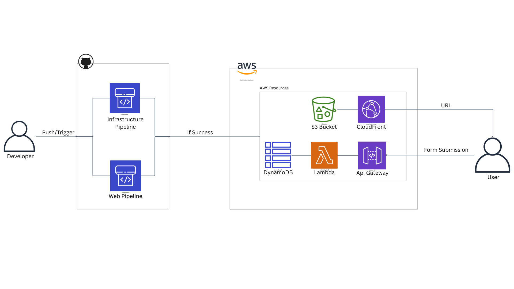

# Pipelines Terraform Project

## Overview
This project is designed to manage infrastructure and web pipelines using Terraform. The pipelines are integrated with AWS services to deploy and manage resources efficiently.

## Architecture Diagram
Below is the architecture diagram for the project:


## Features
### Infrastructure Pipeline
- **Purpose**: Automates the provisioning and management of AWS resources.
- **Resources Managed**:
  - **S3 Bucket**: Stores static files and assets.
  - **CloudFront**: Distributes content globally.
  - **DynamoDB**: Provides database services.
  - **Lambda**: Executes serverless functions.
  - **API Gateway**: Handles API requests.

### Web Pipeline
- **Purpose**: Deploys web applications and integrates with the infrastructure pipeline.
- **Workflow**:
  - Push changes to the repository.
  - Infrastructure pipeline triggers and deploys AWS resources.
  - If successful, the web pipeline deploys the web application.

## Architecture Details
The architecture consists of two main pipelines:
1. **Infrastructure Pipeline**: Responsible for provisioning AWS resources.
2. **Web Pipeline**: Deploys the web application and integrates with the infrastructure pipeline.

### AWS Resources
- **S3 Bucket**: Stores static files and assets.
- **CloudFront**: Distributes content globally.
- **DynamoDB**: Provides database services.
- **Lambda**: Executes serverless functions.
- **API Gateway**: Handles API requests.

### Developer Workflow
1. Push changes to the repository.
2. Infrastructure pipeline triggers and deploys AWS resources.
3. If successful, the web pipeline deploys the web application.

### User Interaction
- Users access the web application via the CloudFront URL.
- Form submissions are processed through the API Gateway and Lambda functions.

## Repository Structure
```
infra/
  terraform/
    modules/
      api-gateway/
      cloudfront/
      dynamodb/
      iam/
      lambda/
      s3/
web/
  frontend/
  lambda/
```

## Getting Started
### Prerequisites
- Install Terraform.
- Configure AWS credentials.

### Steps
1. Clone the repository.
2. Navigate to the `infra/terraform` directory.
3. Run Terraform commands to initialize and apply configurations.
4. Navigate to the `web/frontend` directory to manage the web application.

## Contributing
Contributions are welcome! Please follow the guidelines in the `CONTRIBUTING.md` file.

## License
This project is licensed under the MIT License. See the `LICENSE` file for details.